# Design considerations

## Architecture

Implementation follows [option 3](#option-3-one-opc-ua-proxy-per-opc-ua-server-with-mongodb).

### Option 1: unique OPC-UA proxy (with Centrifugo)

```mermaid
flowchart RL
    classDef dashed stroke-dasharray: 3 3
    proxy[OPC-UA proxy]
    client1[Client] & client2[client] <-- "🡰 subscribes\nnotifies 🡲" --> Centrifugo
    client3[Client] <-. "🡰 subscribes\nnotifies 🡲" .-> Centrifugo
    class client3 dashed
    subgraph internal
        Centrifugo <-- "publishes 🡲\n🡰 proxies subscriptions" --> proxy
        TSDB -- scrapes --> proxy
    end
    opc1[OPC Server]
    opc2[OPC Server]
    opc3[OPC Server]
    opc4[OPC Server]
    class opc4 dashed
    proxy <-- "🡰 subscribes\nnotifies 🡲" --> opc1 & opc2 & opc3
    proxy <-. "🡰 subscribes\nnotifies 🡲" .-> opc4
```

### Option 2: one OPC-UA proxy per OPC-UA server (with Centrifugo)

### Option 3: one OPC-UA proxy per OPC-UA server (with MongoDB)

```mermaid
flowchart LR
    classDef dashed stroke-dasharray: 3 3
    opc1[OPC Server] <-- "🡰 subscribes\nnotifies 🡲" --> proxy1[OPC-UA proxy]
    opc2[OPC Server] <-- "🡰 subscribes\nnotifies 🡲" --> proxy2[OPC-UA proxy]
    opc3[OPC Server] <-- "🡰 subscribes\nnotifies 🡲" --> proxy3[OPC-UA proxy]
    opc4[OPC Server] <-. "🡰 subscribes\nnotifies 🡲" .-> proxy4[OPC-UA proxy]
    class opc4 dashed
    class proxy4 dashed
    subgraph internal
        proxy1 & proxy2 & proxy3 -- updates document --> MongoDB
        proxy4 -. replaces document .-> MongoDB
        TSDB -- scrapes --> MongoDB
    end
```

