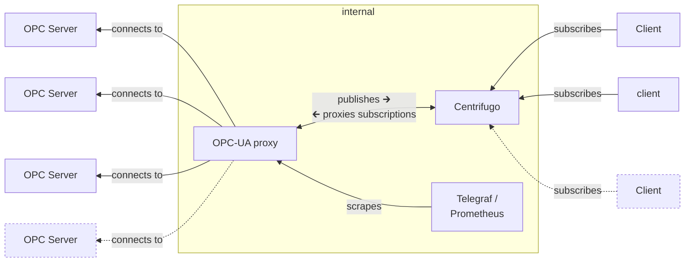
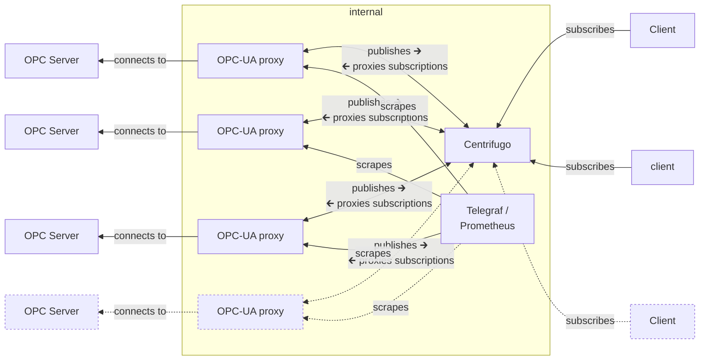

# Design considerations

## Architecture

Implementation follows [option 1](#option-1-unique-opc-ua-proxy).

### Option 1: unique OPC-UA proxy

```mermaid
flowchart RL
    classDef dashed stroke-dasharray: 3 3
    proxy[OPC-UA proxy]
    client1[Client] & client2[client] -- subscribes --> Centrifugo
    client3[Client] -. subscribes .-> Centrifugo
    class client3 dashed
    subgraph internal
        Centrifugo <-- "publishes 🡲\n🡰 proxies subscriptions" --> proxy
        tsdb[Telegraf /\n Prometheus] -- scrapes --> proxy
    end
    opc1[OPC Server]
    opc2[OPC Server]
    opc3[OPC Server]
    opc4[OPC Server]
    class opc4 dashed
    proxy -- connects to --> opc1 & opc2 & opc3
    proxy -. connects to .-> opc4
```

### Option 2: one OPC-UA proxy per OPC-UA server

```mermaid
flowchart RL
    classDef dashed stroke-dasharray: 3 3
    proxy1[OPC-UA proxy]
    proxy2[OPC-UA proxy]
    proxy3[OPC-UA proxy]
    proxy4[OPC-UA proxy]
    class proxy4 dashed;
    client1[Client] & client2[client] -- subscribes --> Centrifugo
    client3[Client] -. subscribes .-> Centrifugo
    class client3 dashed
    subgraph internal
        Centrifugo <-- "publishes 🡲\n🡰 proxies subscriptions" --> proxy1 & proxy2 & proxy3
        Centrifugo <-. "publishes 🡲\n🡰 proxies subscriptions" .-> proxy4
        tsdb[Telegraf /\n Prometheus] -- scrapes --> proxy1 & proxy2 & proxy3
        tsdb[Telegraf /\n Prometheus] -. scrapes .-> proxy4
    end
    opc1[OPC Server]
    opc2[OPC Server]
    opc3[OPC Server]
    opc4[OPC Server]
    class opc4 dashed
    proxy1 -- connects to --> opc1
    proxy2 -- connects to --> opc2
    proxy3 -- connects to --> opc3
    proxy4 -. connects to .-> opc4
```
