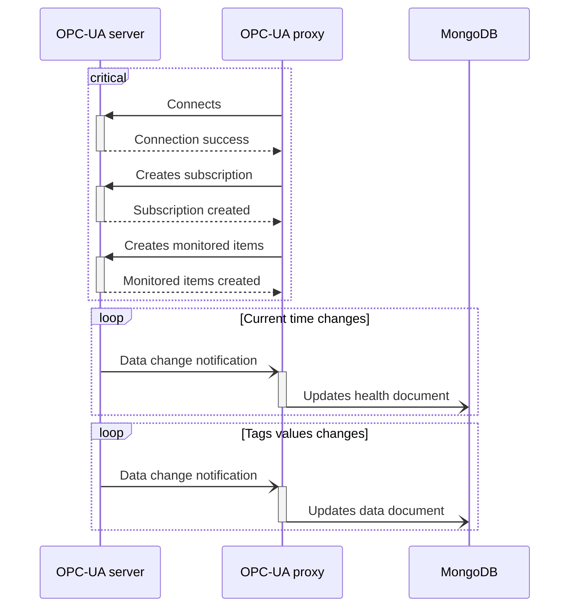

# OPC-UA proxy

[](https://conventionalcommits.org)

A proxy microservice writing OPC-UA data changes to MongoDB.

## Design

See [DESIGN.md](DESIGN.md).

## Specifications

### Tags configuration

When starting, this service will query the configuration URL argument, joined with the partner ID argument, for tags to which it will subscribe on.

The configuration API must return tags configuration in the form of a JSON array, whose each element can be of one of following formats.

#### Nodes container

This format allows to collect tags from an OPC-UA container node which has [`HasComponent`][hascomponent] forward reference(s). Each referenced node will be added to the tag set to monitor, with its [`DisplayName`][displayname] as tag name.

```jsonc
{
  "container": {
    "namespaceUri": "urn:namespace",
    "nodeIdentifier": "containerNode"
  }
}
```

| Key              | Value type                          | Description                         |
| ---------------- | ----------------------------------- | ----------------------------------- |
| `namespaceUri`   | string                              | OPC-UA namespace URI                |
| `nodeIdentifier` | string \| number (positive integer) | OPC-UA [NodeId][nodeid] identifier* |

_\* identifier type will be inferred from JSON type._

[hascomponent]: https://reference.opcfoundation.org/Core/Part3/v105/docs/7.7
[displayname]: https://reference.opcfoundation.org/Core/Part3/5.2.5/
[nodeid]: https://reference.opcfoundation.org/v104/Core/docs/Part3/8.2.1/

### MongoDB

Queries to MongoDB will use following parameters:

- database: `opcua`;
- document primary key (`_id`): partner ID, from configuration flag.

When it starts, this service will delete the corresponding document in `data` collection.

### OPC-UA data change

For each data change notification received from the OPC-UA server, an update query will be issued to MongoDB on collection `data`, as a document comprising following fields:

- `val`: mapping of tag names to their values;
- `ts`: mapping of tag names to to the timestamp of last value change;
- `updatedAt`: MongoDB current date and time.

### Health

This service subscribes to OPC-UA server current time. Each time a data change notification is received, it sends an update query on `health` collection to MongoDB, with following document fields:

- `serverDateTime`: OPC-UA server timestamp as BSON DateTime;
- `updatedAt`: MongoDB current date and time.

## Data flow



## Configuration

```ShellSession
$ opcua-proxy --help
Usage: opcua-proxy [OPTIONS] --partner-id <PARTNER_ID> --config-api-url <CONFIG_API_URL> --pki-dir <PKI_DIR> --opcua-server-url <OPCUA_SERVER_URL>

Options:
      --partner-id <PARTNER_ID>
          OPC-UA partner device ID [env: PARTNER_ID=]
      --mongodb-uri <MONGODB_URI>
          URL of MongoDB database [env: MONGODB_URI=] [default: mongodb://mongodb]
      --config-api-url <CONFIG_API_URL>
          Base API URL to get configuration from [env: CONFIG_API_URL=]
      --pki-dir <PKI_DIR>
          [env: PKI_DIR=]
      --opcua-server-url <OPCUA_SERVER_URL>
          URL of OPC-UA server to connect to [env: OPCUA_SERVER_URL=]
      --opcua-security-policy <OPCUA_SECURITY_POLICY>
          OPC-UA security policy [env: OPCUA_SECURITY_POLICY=] [default: Basic256Sha256]
      --opcua-security-mode <OPCUA_SECURITY_MODE>
          OPC-UA security mode [env: OPCUA_SECURITY_MODE=] [default: SignAndEncrypt]
      --opcua-user <OPCUA_USER>
          OPC-UA authentication username (optional) [env: OPCUA_USER=]
      --opcua-password <OPCUA_PASSWORD>
          OPC-UA authentication password (optional) [env: OPCUA_PASSWORD=]
  -v, --verbose...
          More output per occurrence
  -q, --quiet...
          Less output per occurrence
  -h, --help
          Print help
```
