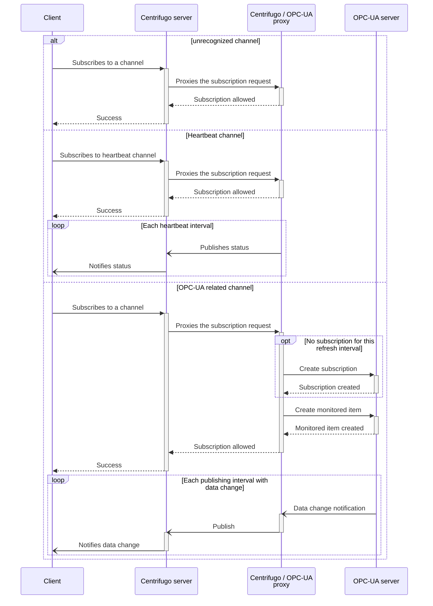
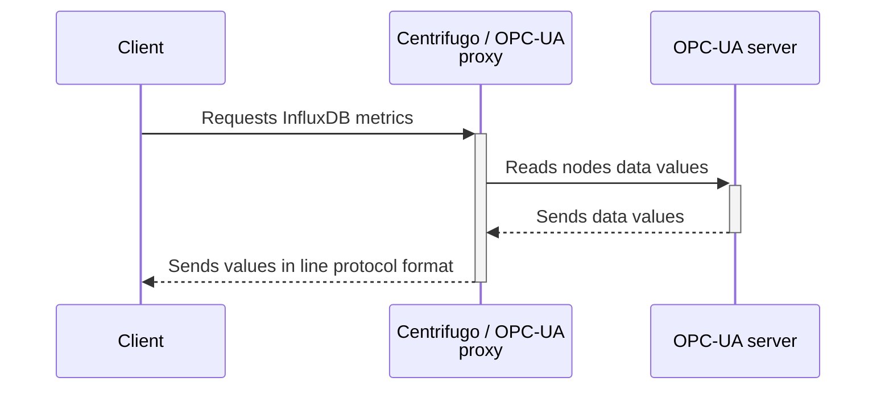

<!-- markdownlint-configure-file { "MD033": { "allowed_elements": [ "br" ] } } -->
# OPC-UA proxy

[](https://github.com/cailloumajor/opcua-proxy/actions/workflows/tests.yml)
[](https://conventionalcommits.org)

A proxy microservice connecting to an OPC-UA server and offering:

- Data change subscriptions through Centrifugo;
- InfluxDB metrics.

## Specifications

### Nodes object

OPC-UA nodes are represented as a JSON object with following fields:

- *namespaceURI*: namespace URI for nodes to monitor (string)
- *nodes*: array of node identifiers, with mapping below:

| JSON type                       | [NodeID type][3] |
| ------------------------------- | ---------------- |
| Integer (positive whole number) | Numeric          |
| String                          | String           |

### Centrifugo subscriptions

[1]: https://centrifugal.dev/docs/server/proxy#subscribe-proxy
[2]: https://centrifugal.dev/docs/server/channels#channel-namespaces
[3]: https://reference.opcfoundation.org/v105/Core/docs/Part3/8.2.3/

- A Centrifugo server (at least v3.1.1) is configured to [proxy subscriptions][1] to this service (`/centrifugo/subscribe` endpoint).
- Clients interested in OPC-UA values changes subscribe to Centrifugo with following characteristics:
  - *Channel*: name and interval, separated by `@`, e.g. `my_nodes@2000`, with:
    - *name*: unique identifier for each nodes set.
    - *interval*: publishing interval in milliseconds.
    - **Note**: channel [namespace][2] is reserved for configuring the proxy endpoint.
  - *Data*: Nodes object (see [above](#nodes-object)).

### InfluxDB metrics endpoint

A `GET` request on `/influxdb-metrics` endpoint returns the configured nodes data values, in InfluxDB line protocol format. Measurement name must be given as the value of `measurement` URL parameter. Other query parameters are expected to each have one value and will be emitted as tags.

The nodes to be read are defined in a JSON file, located in configured path, and containing an array of Nodes objects (see [above](#nodes-object)).

## Data flow

Connection to OPC-UA server and session establishment are considered to have been done successfully.

### Subscriptions



### InfluxDB metrics



## Configuration

:construction: WIP :construction:

```ShellSession
```
