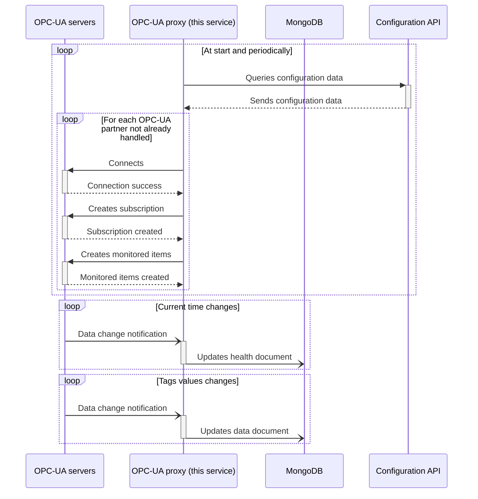

# OPC-UA proxy

[](https://conventionalcommits.org)

A proxy microservice writing OPC-UA data changes to MongoDB.

## Design

See [DESIGN.md](DESIGN.md).

## Specifications

### Public Key Infrastructure (PKI)

PKI path is configured with a CLI option (see [Configuration](#configuration)).

### OPC-UA partners configuration

This service will periodically query the configuration API, to get the configuration for all OPC-UA partners as a JSON array of objects.

Each object is expected to have the following format.

| Key              | Value type       | Description                                     |
| ---------------- | ---------------- | ----------------------------------------------- |
| `_id`            | string           | OPC-UA partner ID                               |
| `serverUrl`      | string           | OPC-UA server URL                               |
| `securityPolicy` | string           | OPC-UA security policy                          |
| `securityMode`   | string           | OPC-UA security mode                            |
| `user`           | string \| `null` | OPC-UA authentication username                  |
| `password`       | string \| `null` | OPC-UA authentication password                  |
| `tags`           | array of objects | Description of tags to subscribe on (see below) |

Each element of `tags` array is an object with a `type` property and is of one of the following formats.

#### Nodes container

This format allows to collect tags from an OPC-UA container node which has [`HasComponent`][hascomponent] forward reference(s). Each referenced node will be added to the tag set to monitor, with its [`DisplayName`][displayname] as tag name.

```jsonc
{
  // ...
  "tags": [
    // ...
    {
      "type": "container",
      "namespaceUri": "urn:namespace",
      "nodeIdentifier": "containerNode"
    }
    // ...
  ]
  // ...
}
```

| Key              | Value type                          | Description                         |
| ---------------- | ----------------------------------- | ----------------------------------- |
| `namespaceUri`   | string                              | OPC-UA namespace URI                |
| `nodeIdentifier` | string \| number (positive integer) | OPC-UA [NodeId][nodeid] identifier* |

_\* identifier type will be inferred from JSON type._

#### Single tag

This format directly refers to a single tag.

```jsonc
{
  // ...
  "tags": [
    // ...
    {
      "type": "tag",
      "name": "tagName",
      "namespaceUri": "urn:namespace",
      "nodeIdentifier": "someNode"
    }
    // ...
  ]
  // ...
}
```

| Key              | Value type                          | Description                         |
| ---------------- | ----------------------------------- | ----------------------------------- |
| `name`           | string                              | Tag name                            |
| `namespaceUri`   | string                              | OPC-UA namespace URI                |
| `nodeIdentifier` | string \| number (positive integer) | OPC-UA [NodeId][nodeid] identifier* |

_\* identifier type will be inferred from JSON type._

[hascomponent]: https://reference.opcfoundation.org/Core/Part3/v105/docs/7.7
[displayname]: https://reference.opcfoundation.org/Core/Part3/5.2.5/
[nodeid]: https://reference.opcfoundation.org/v104/Core/docs/Part3/8.2.1/

### MongoDB

Queries to MongoDB will use following parameters:

- database: as configured by service argument;
- document primary key (`_id`): OPC-UA partner ID.

When it starts, this service will initialize all documents in `data` collection.

### OPC-UA data change

For each data change notification received from the OPC-UA servers, an update query will be issued to MongoDB on collection `data`, as a document comprising following fields:

- `val`: mapping of tag names to their values;
- `ts`: mapping of tag names to to the timestamp of last value change;
- `updatedAt`: MongoDB current date and time.

### Health

This service subscribes to OPC-UA server current time. Each time a data change notification is received, it sends an update query on `health` collection to MongoDB, with following document fields:

- `serverDateTime`: OPC-UA server timestamp as BSON DateTime;
- `updatedAt`: MongoDB current date and time.

## Data flow



## Configuration

```ShellSession
$ opcua-proxy --help
Usage: opcua-proxy [OPTIONS] --mongodb-database <MONGODB_DATABASE> --config-api-url <CONFIG_API_URL> --pki-dir <PKI_DIR>

Options:
      --mongodb-uri <MONGODB_URI>
          URL of MongoDB server [env: MONGODB_URI=] [default: mongodb://mongodb]
      --mongodb-database <MONGODB_DATABASE>
          Name of the MongoDB database to use [env: MONGODB_DATABASE=]
      --config-api-url <CONFIG_API_URL>
          Base API URL to get configuration from [env: CONFIG_API_URL=]
      --pki-dir <PKI_DIR>
          Path of the PKI directory [env: PKI_DIR=]
  -v, --verbose...
          Increase logging verbosity
  -q, --quiet...
          Decrease logging verbosity
  -h, --help
          Print help
```
