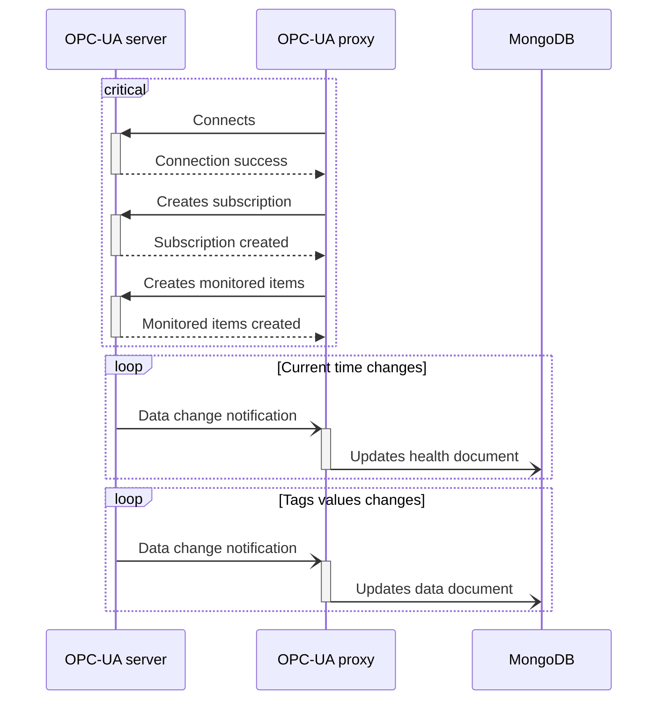

# OPC-UA proxy

[](https://conventionalcommits.org)
[](https://app.bors.tech/repositories/60476)

A proxy microservice writing OPC-UA data changes to MongoDB.

## Design

See [DESIGN.md](DESIGN.md).

## Specifications

### Tag set

The tags to read from OPC-UA server are grouped into a tag set, which is represented in JSON format as an array of objects.

```jsonc
[
  { "name": "firstTag",  "nsu": "urn:namespace", "nid": "node1" },
  { "name": "secondTag", "nsu": "urn:namespace", "nid": 2 },
  // ...
]
```

Each object in the array consists of key/value pairs described below.

| Key    | Value type                          | Description                         |
| ------ | ----------------------------------- | ----------------------------------- |
| `name` | string                              | Tag name                            |
| `nsu`  | string                              | OPC-UA namespace URI                |
| `nid`  | string \| number (positive integer) | OPC-UA [NodeId][nodeid] identifier* |

_\*[NodeId][nodeid] identifier type will be inferred from JSON type._

[nodeid]: https://reference.opcfoundation.org/v104/Core/docs/Part3/8.2.1/

### MongoDB

Queries to MongoDB will use following parameters:

- database: `opcua`;
- document primary key (`_id`): partner ID, from configuration flag.

### OPC-UA data change

For each data change notification received from the OPC-UA server, an update query will be issued to MongoDB on collection `data`, as a document comprising following fields:

- `data`: mapping of tag names to their values;
- `sourceTimestamps`: mapping of tag names to to the timestamp of last value change;
- `updatedAt`: MongoDB current date and time.

### Health

This service subscribes to OPC-UA server current time. Each time a data change notification is received, it sends an update query on `health` collection to MongoDB, with following document fields:

- `serverDateTime`: OPC-UA server timestamp as BSON DateTime;
- `updatedAt`: MongoDB current date and time.

## Data flow



## Configuration

```ShellSession
$ opcua-proxy --help
Usage: opcua-proxy [OPTIONS] --partner-id <PARTNER_ID> --tag-set-config-path <TAG_SET_CONFIG_PATH> --pki-dir <PKI_DIR> --opcua-server-url <OPCUA_SERVER_URL>

Options:
  -v, --verbose...
          More output per occurrence
  -q, --quiet...
          Less output per occurrence
      --partner-id <PARTNER_ID>
          OPC-UA partner device ID [env: PARTNER_ID=]
      --mongodb-uri <MONGODB_URI>
          URL of MongoDB database [env: MONGODB_URI=] [default: mongodb://mongo]
      --tag-set-config-path <TAG_SET_CONFIG_PATH>
          Path of JSON file to get tag set from [env: TAG_SET_CONFIG_PATH=]
      --pki-dir <PKI_DIR>
          [env: PKI_DIR=]
      --opcua-server-url <OPCUA_SERVER_URL>
          URL of OPC-UA server to connect to [env: OPCUA_SERVER_URL=]
      --opcua-security-policy <OPCUA_SECURITY_POLICY>
          OPC-UA security policy [env: OPCUA_SECURITY_POLICY=] [default: Basic256Sha256]
      --opcua-security-mode <OPCUA_SECURITY_MODE>
          OPC-UA security mode [env: OPCUA_SECURITY_MODE=] [default: SignAndEncrypt]
      --opcua-user <OPCUA_USER>
          OPC-UA authentication username (optional) [env: OPCUA_USER=]
      --opcua-password <OPCUA_PASSWORD>
          OPC-UA authentication password (optional) [env: OPCUA_PASSWORD=]
  -h, --help
          Print help information
```
