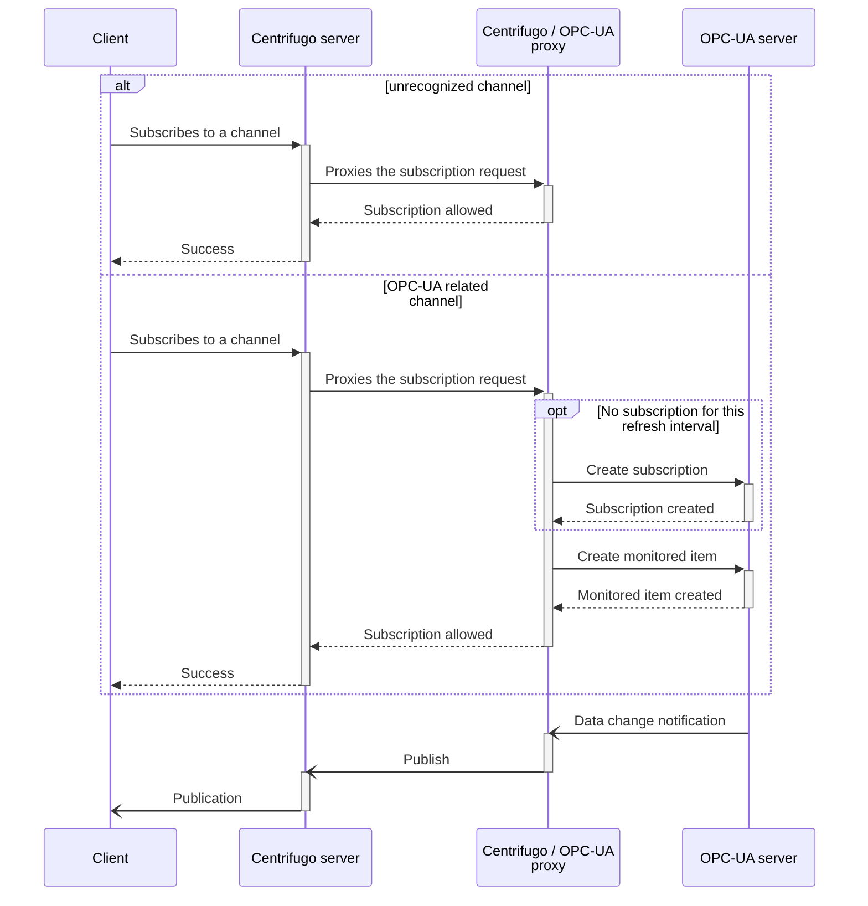

<!-- markdownlint-configure-file { "MD033": { "allowed_elements": [ "br" ] } } -->
# OPC-UA / Centrifugo proxy

[](https://github.com/cailloumajor/opcua-centrifugo/actions/workflows/tests.yml)
[](https://conventionalcommits.org)

A microservice to proxy OPC-UA data change subscription through Centrifugo.

## Specifications

[1]: https://centrifugal.dev/docs/server/proxy#subscribe-proxy
[2]: https://centrifugal.dev/docs/server/channels#channel-namespaces

- A Centrifugo server (at least v3.1.1) is configured to [proxy subscriptions][1] to this service.
- Clients interested in OPC-UA values changes subscribe to Centrifugo with following characteristics:
  - *Channel*: name and interval, separated by `@`, e.g. `my_nodes@2000`, with:
    - *name*: unique identifier for each nodes set.
    - *interval*: publishing interval in milliseconds.
    - **Note**: channel [namespace][2] is reserved for configuring the proxy endpoint.
  - *Data*: JSON object with following fields:
    - *namespaceURI*: namespace URI for nodes to monitor
    - *nodes*: array of all individual nodes to monitor (structures and arrays must be flattened)

## Data flow



## Configuration

This project uses standard library's [flag](https://pkg.go.dev/flag) and <https://github.com/peterbourgon/ff>
packages, configuration can be provided by flags or environment variables.

```ShellSession
$ opcua-centrifugo -help
USAGE
  opcua-centrifugo [options]

OPTIONS
  Flag                     Env Var                 Description
  -centrifugo-api-address  CENTRIFUGO_API_ADDRESS  Centrifugo API endpoint
  -centrifugo-api-key      CENTRIFUGO_API_KEY      Centrifugo API key
  -centrifugo-namespace    CENTRIFUGO_NAMESPACE    Centrifugo channel namespace for this instance
  -debug                                           log debug information (default: false)
  -opcua-cert-file         OPCUA_CERT_FILE         certificate file path for OPC-UA secure channel (optional)
  -opcua-client-timeout    OPCUA_CLIENT_TIMEOUT    timeout for connecting the OPC-UA client (default: 10s)
  -opcua-key-file          OPCUA_KEY_FILE          private key file path for OPC-UA secure channel (optional)
  -opcua-password          OPCUA_PASSWORD          password for OPC-UA authentication (optional)
  -opcua-server-url        OPCUA_SERVER_URL        OPC-UA server endpoint URL (default: opc.tcp://127.0.0.1:4840)
  -opcua-tidy-interval     OPCUA_TIDY_INTERVAL     interval at which to tidy-up OPC-UA subscriptions (default: 30s)
  -opcua-user              OPCUA_USER              user name for OPC-UA authentication (optional)
  -proxy-listen            PROXY_LISTEN            Centrifugo proxy listen address (default: :8080)
```
