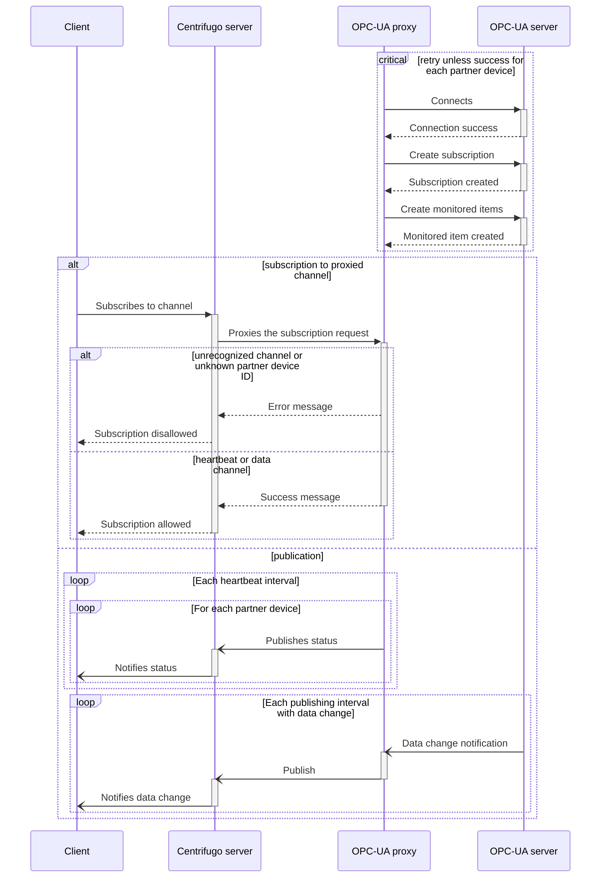

# OPC-UA proxy

[](https://github.com/cailloumajor/opcua-proxy/actions/workflows/tests.yml)
[](https://conventionalcommits.org)

A proxy microservice connecting to OPC-UA servers and offering:

- Data change and heartbeat publications to Centrifugo;
- Centrifugo subscribe proxy providing current tags values;
- InfluxDB metrics.

## Design

See [DESIGN.md](DESIGN.md).

## Specifications

### Tag set

The tags to read from each partner (OPC-UA server) are grouped into a tag set, which is provided in JSON format as an array of objects.

```jsonc
[
  { "name": "firstTag",  "nsu": "urn:namespace", "nid": "node1" },
  { "name": "secondTag", "nsu": "urn:namespace", "nid": 2 },
  // ...
]
```

Each object in the array consists of key/value pairs described below.

| Key    | Value type                          | Description                         |
| ------ | ----------------------------------- | ----------------------------------- |
| `name` | string                              | Tag name                            |
| `nsu`  | string                              | OPC-UA namespace URI                |
| `nid`  | string \| number (positive integer) | OPC-UA [NodeId][nodeid] identifier* |

_\*[NodeId][nodeid] identifier type will be inferred from JSON type._

[nodeid]: https://reference.opcfoundation.org/v104/Core/docs/Part3/8.2.1/

### Data change publications

For each data change notification received from an OPC-UA server, a publication is emitted to Centrifugo server, with following parameters:

- `channel`: `opcua:data;<ID>`, with _ID_ being the identifier of the partner device;
- `data`: JSON object with tag name and value pairs.

### Heartbeat publications

Every heartbeat interval (see [configuration](#configuration)), a publication is emitted to Centrifugo server, with following parameters:

- `channel`: `opcua:heartbeat;<ID>`, with _ID_ being the identifier of the partner device;
- `data`: status of the OPC-UA connection to the partner device.

### Centrifugo subscribe proxy

If the Centrifugo server is configured to [proxy subscriptions][sub-proxy] on `opcua` channel to this service (on `/centrifugo/subscribe` endpoint), last known values for the tag set will be sent to the client in `subscribed` event context.

[sub-proxy]: https://centrifugal.dev/docs/server/proxy#subscribe-proxy

### InfluxDB metrics endpoint

A `GET` request on `/influxdb-metrics` endpoint returns last known values for the tag set of each partner device, in InfluxDB line protocol format (one line for each partner).

Measurement name must be given as the value of `measurement` URL parameter.

`id` tag will be set to the identifier of the partner device.

Other query parameters are expected to each have one value and will be emitted as tags.

## Data flow

Connection to OPC-UA server and session establishment are considered to have been done successfully.

### Subscriptions



## Configuration

This project uses standard library's [flag](https://pkg.go.dev/flag) and <https://github.com/peterbourgon/ff>
packages, configuration can be provided by flags or environment variables.

```ShellSession
$ opcua-proxy -help
USAGE
  opcua-proxy [options]

OPTIONS
  Flag                     Env Var                 Description
  -api-listen              API_LISTEN              API listen address (default: :8080)
  -centrifugo-api-address  CENTRIFUGO_API_ADDRESS  Centrifugo API endpoint
  -centrifugo-api-key      CENTRIFUGO_API_KEY      Centrifugo API key
  -centrifugo-namespace    CENTRIFUGO_NAMESPACE    Centrifugo channel namespace for this instance
  -debug                                           log debug information (default: false)
  -heartbeat-interval      HEARTBEAT_INTERVAL      Heartbeat interval (default: 5s)
  -opcua-cert-file         OPCUA_CERT_FILE         certificate file path for OPC-UA secure channel (optional)
  -opcua-key-file          OPCUA_KEY_FILE          private key file path for OPC-UA secure channel (optional)
  -opcua-password          OPCUA_PASSWORD          password for OPC-UA authentication (optional)
  -opcua-server-url        OPCUA_SERVER_URL        OPC-UA server endpoint URL (default: opc.tcp://127.0.0.1:4840)
  -opcua-tidy-interval     OPCUA_TIDY_INTERVAL     interval at which to tidy-up OPC-UA subscriptions (default: 30s)
  -opcua-user              OPCUA_USER              user name for OPC-UA authentication (optional)
  -read-nodes-url          READ_NODES_URL          URL to query for nodes to read
```
